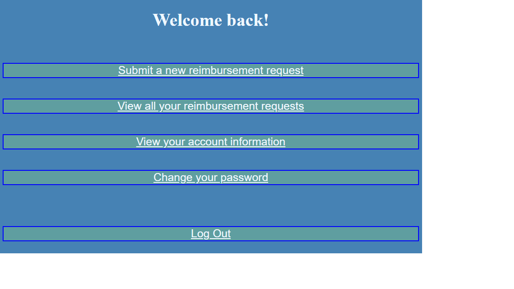

# Expense Reimbursement System

## Project Description

An application for employees to use to request for reimbursements on various work related expenses. Employees will be able to login and submit reimbursement requests while viewing the status of any existing requests. Managers will be able to login and view and sort the existing reimbursement requests and resolve any pending requests.

## Technologies Used

* Java 1.8
* Gradle
* MongoDB
* Javalin

## Features

* Employees can view and submit their reimbursement requests
* Employees can change their account password
* Managers can view all reimbursement requests
* Managers can sort reimbursement requests by employee
* Managers can approve and deny reimbursement requests

## Getting Started

In your command line, run ``git clone https://github.com/mfong5/expense-reimbursement-system``
To run the project go to src/main/java in the cloned directory and run ``java Main``

## Usage

Users may login to the application through the employee portal and managers will use the manager portal. Employees will be able to select 4 options:

Click on each bar to access their stated function.

